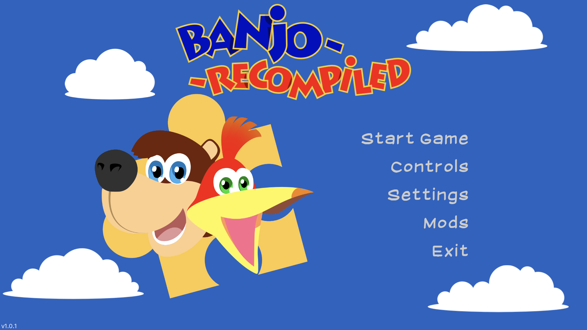
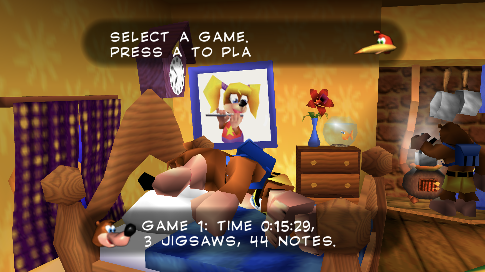
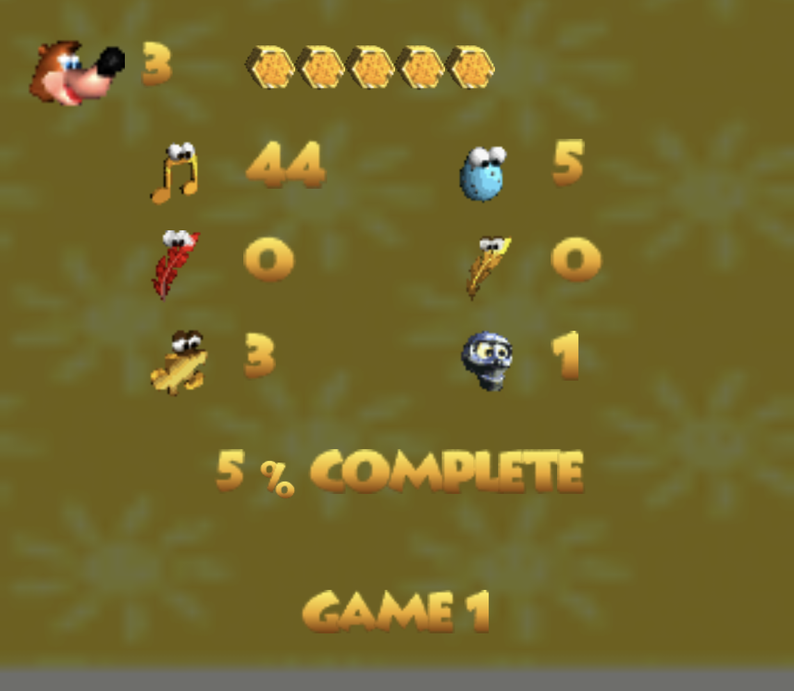
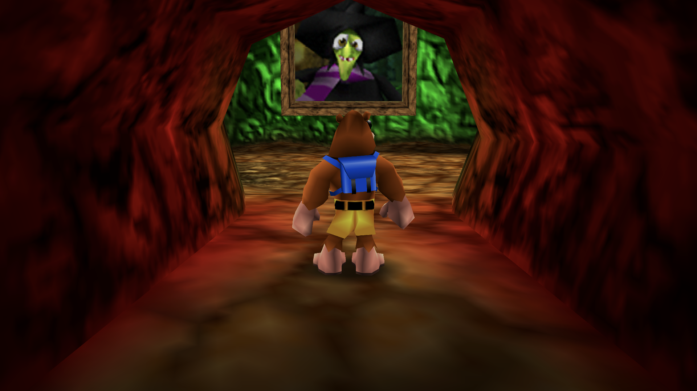
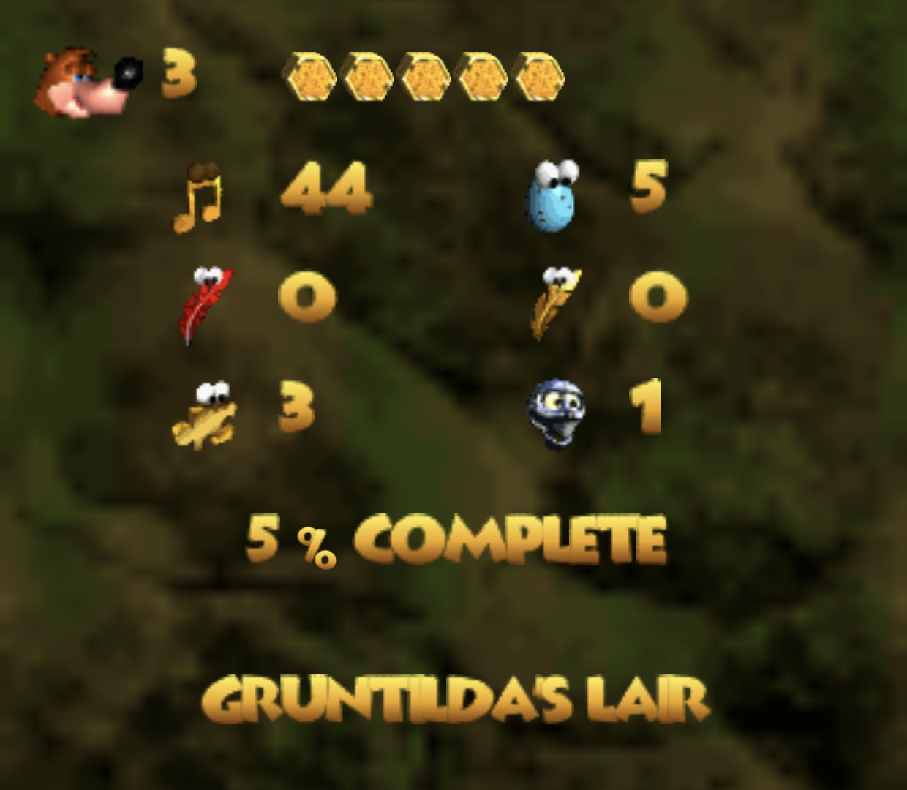
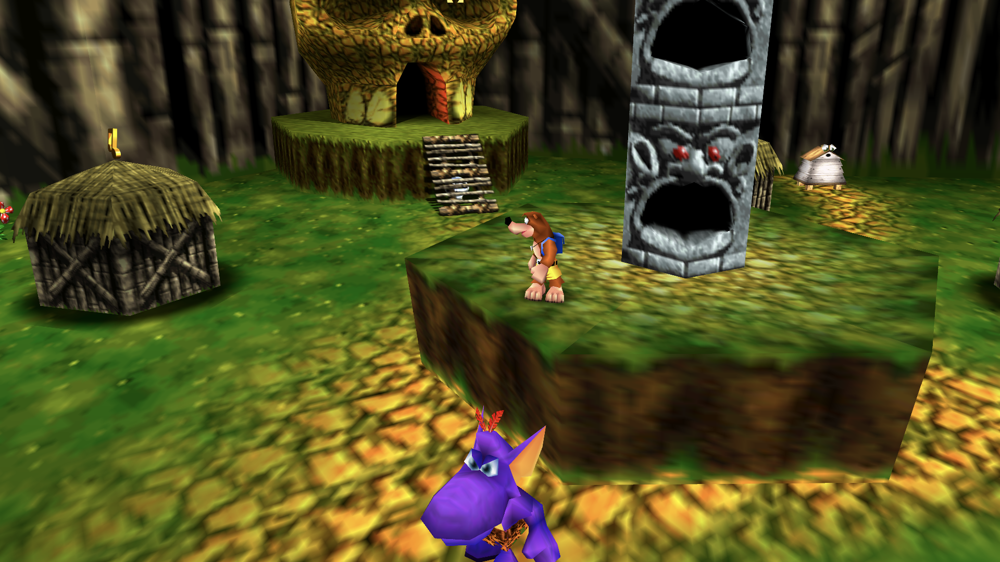
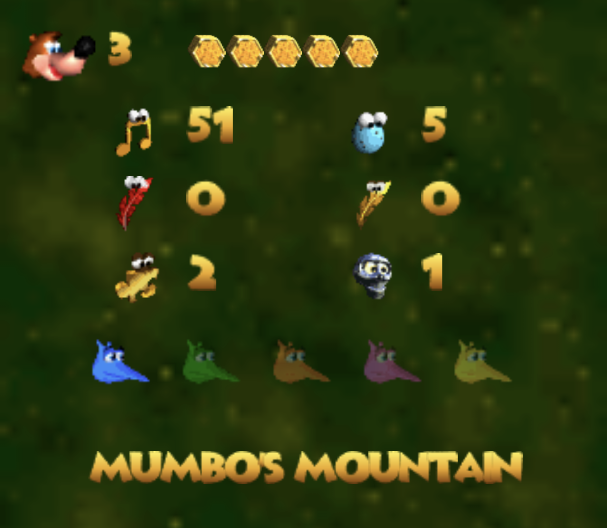

# Banjo: Recompiled for Android

**Banjo-Kazooie, recompiled for Android handhelds. With the full Banjo: Recompiled feature set, controller support, and dual screen support.**

> This repository and its releases do not contain game assets. You must provide your own supported Banjo-Kazooie ROM to build or run the project.

## Features

### Feature complete with the PC version

- High-framerate and widescreen support from the PC version.
- Faithful audio and original game behavior.
- Modern quality of life features such as note saving.
- Full mod support, including local mod and texture-pack import.

### Full controller support

Designed with Android handhelds in mind. Tested on the AYN Thor.

### Dual-screen companion display

On supported devices, the second screen becomes a live companion display, including:

- Animated icons for game status and collectibles.
- Dynamic backgrounds based on the current game area.
- Live gameplay stats such as health, lives, notes, eggs, feathers, Jiggies, Mumbo tokens, Jinjos, and level context.
- Smooth transitions between areas.

## Screenshots

| Label | Primary display | Secondary display |
|---|---|---|
| Main menu |  |  |
| Slot select |  |  |
| Gruntilda's lair |  |  |
| Mumbo's Mountain |  |  |

## Mods on Android

The Android port keeps Banjo: Recompiled's mod-friendly design. Mods and texture packs can be imported into app-private storage and used without turning the Android build into a different project or bundling game assets into the APK.

## Development notes

For Android setup, build commands, ADB verification, screenshot capture conventions, and artifact hygiene, see [docs/android-port.md](docs/android-port.md).

For the experimental dual-screen implementation details, see:

- [Android dual-screen companion display API](docs/android-dualscreen-framework-api.md)
- [Dual-screen ownership boundaries](docs/plans/android-dualscreen-framework-ownership.md)
- [Dual-screen transition findings](docs/android-dual-screen-transition-findings.md)

## Upstream project and credits

This Android port is based on Banjo: Recompiled. See [README.original.md](README.original.md) for the original project overview, desktop feature list, FAQ, and upstream acknowledgements.

Core upstream projects include:

- [N64: Recompiled](https://github.com/N64Recomp/N64Recomp)
- [RT64](https://github.com/rt64/rt64)
- [N64ModernRuntime](https://github.com/N64Recomp/N64ModernRuntime)
- [RecompFrontend](https://github.com/N64Recomp/RecompFrontend)
- [Banjo-Kazooie Decompilation](https://gitlab.com/banjo.decomp/banjo-kazooie)
